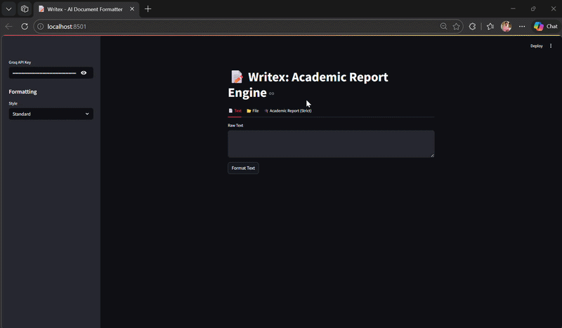

# Writex: Academic Report Engine

## 🎥 Demo



Transform raw code into structured technical reports in seconds.

Writex is a smart tool that helps engineering students automatically generate perfectly formatted B.Tech project reports. Just upload your project code (ZIP file), and Writex uses AI to read the code and write a complete 6-chapter university report for you in a ready-to-print Microsoft Word (`.docx`) file. 

Additionally, Writex can instantly reformat any messy text or old document into standard professional styles like IEEE or APA.

## ✨ What It Does

* **Code to Report:** Upload your `src/` folder ZIP. The AI reads your code and writes the Abstract, Introduction, System Architecture, Implementation details, and Conclusion automatically.
* **Safe & Secure:** Your uploaded code never saves to our systems. It is processed in memory and immediately discarded.
* **Instantly Formatted:** The final Word document comes perfectly styled with a Table of Contents, Title Page, Certificate, and Acknowledgement already filled out.
* **Lightning Fast:** Generates a full 30+ page technical report in under 45 seconds using advanced parallel processing.
* **Document Refresher:** Paste messy text or upload an old PDF, and Writex will redesign the headings and layout into strict IEEE or APA academic standards.

## 🧠 Architecture Overview

Writex implements a multi-stage AI documentation pipeline that bridges deterministic static analysis with advanced LLM synthesis. By passing code through an AST Map-Reduce layer prior to generation, this architecture directly solves common LLM limitations—such as context dilution and hallucination—ensuring that all technical narratives are strictly grounded in your actual codebase.


### Key Design Principles

*   **Deterministic Parsing (AST):** Eliminates hallucination by extracting exact class structures, function footprints, and import graphs before any LLM involvement.
*   **Separation of Concerns:** System decoupled into distinct, purpose-built layers: User Interface, Analysis & Extraction, AI Orchestration, and Validation & Rendering.
*   **Validation & Auto-Healing:** Multi-pass validation gates ensure document structural integrity, automatically correcting heading hierarchies and formatting drift before output.
*   **Structured End-to-End Flow:** A seamless pipeline that securely translates raw code payloads into perfectly formatted, ready-to-print academic reports in-memory.

## 🛠️ Built With

* **Frontend:** Streamlit 
* **AI Brain:** Groq (Llama-3 70B)
* **Document Generator:** `python-docx`

## � How to Run It Locally

1. **Download the code:**
   ```bash
   git clone https://github.com/yourusername/writex.git
   cd writex
   ```

2. **Install the required packages:**
   ```bash
   pip install -r requirements.txt
   ```

3. **Add your API Key:**
   Make a file named `.env` in the folder and paste your Groq API key inside it like this:
   ```ini
   GROQ_API_KEY=your_key_here
   ```

4. **Start the app!**
   ```bash
   streamlit run src/app.py
   ```

## 🤝 Contributing
Feel free to open issues or submit pull requests if you want to help make Writex even better.

## 📝 License
This project is licensed under the MIT License.
